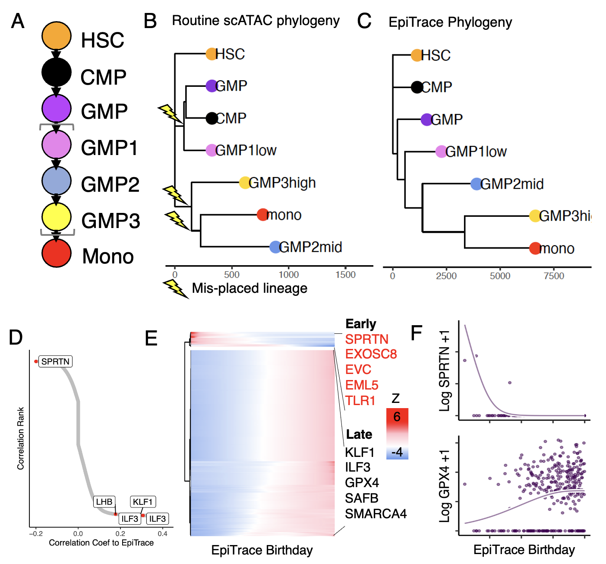

# EpiTrace
 Computing cell age with bulk and single-cell ATAC-seq data   
 
 For example code, see vignettes/Hematopoiesis_2016_demo.notebook.Rmd or vignettes/Hematopoiesis_2016_demo.notebook.nb.html  

 Maintainer: Zhang Yi <synapse@pku.edu.cn>      
 
 


### Updates   

20231011     
1. Updated reference set:
- G4 regions are functionally equivalent to species-specific ClockDML when available, and could extend the application of EpiTrace to organism without ClockDML.
- G-quadruplex (G4) harboring sites (pGQS) are provided for human (hg19), mouse (mm10), zebrafish (drerio10), fly (dm6), nematode (ce11) and yeast (sc3) genomes.
- Source of G4 regions: GSE110582 (mm10, dm6, ce11, sc3), GSE187007 (hg19), or G4Hunter prediction (drerio10).
- G4Hunter source: https://github.com/LacroixLaurent/G4HunterPaperGit

    
20221021     
1. Updated usage (see below).  
- EpiTraceAge_Convergence function  
- Using the non-human reference putative clock-like loci   
- Determining non-human reference putative clock-like loci in vertebrates   
- Determining non-human reference putative clock-like loci in remote species (for example, invertebrates)    


20221008     
1. Added frequently used non-human clockDML-like genomic regions as reference set for EpiTrace inference in these species.  
- Drosophila (interesting one)  
- Zebrafish  
- Mouse   

  
20220910   
1. Added mouse ClockDML sites (from Zhou et al 2022, PMID 35873672) for mouse single cell EpiTrace inference.  
  
20220611   
1. Added .rds files similar to the clock_gr_list data (for external loading).  
2. Added %ni% function (taken from ArchR).      

20220510   
1. Iteration code has been updated. Please use EpiTraceAge_Convergence().   
Example demos for EpiTraceAge_Convergence() would be avaiable soon.  


### Citation
Xinghuan Wang, Wan Jin, Gang Wang, Lingao Ju, Fangjin Chen, Kaiyu Qian, Yu Xiao and Yi Zhang, *Tracking single cell evolution via clock-like chromatin accessibility*, (2022) bioRxiv 2022.05.12.491736; doi: https://doi.org/10.1101/2022.05.12.491736          



 
### Installation
```
library(devtools)   
devtools::install_github('MagpiePKU/EpiTrace')    
```

### Basic Usage (Example)  
```
library(EpiTrace)  
data("clock_gr_list")  
data("hematopoiesis.2018")   
initiated_peaks <- Init_Peakset(inputpeak)  
inputmatrix <- Init_Matrix(cell_metadata$celltype,initiated_peaks,inputmatrix)
epitrace_obj <- EpiTrace_prepare_object(initiated_peaks,inputmatrix,cell_metadata$celltype,ref_genome = 'hg19',non_standard_clock = F,clock_gr_list = clock_gr_list)  
epitrace_obj_age_estimated <- RunEpiTraceAge(epitrace_obj)  
phylotree_res <- RunEpiTracePhylogeny(epitrace_obj_age_estimated)  
```

### To plot a phylogenetic tree
```
phylotree_res_myeloid <- RunEpiTracePhylogeny(subset(epitrace_obj_age_estimated,celltype %in% c('HSC','MPP','CMP','GMP','Monocyte')))   
mitosis_tree <- phylotree_res_myeloid[['MitosisClock']][[2]]  
mitosis_tree <- ape::root(mitosis_tree,outgroup='HSC')  
plot(mitosis_tree)  
```

### To compute age-peak association  
```
associated_res_HSC <- AssociationOfPeaksToAge(subset(epitrace_obj_age_estimated,celltype %in% 'HSC'))   
```
 
### Iterative update of age estimation    
```
library(EpiTrace)  
data("clock_gr_list")  
data("hematopoiesis.2018")   
initiated_peaks <- Init_Peakset(inputpeak)  
inputmatrix <- Init_Matrix(cell_metadata$celltype,initiated_peaks,inputmatrix)
epitrace_obj <- EpiTrace_prepare_object(initiated_peaks,inputmatrix,cell_metadata$celltype,ref_genome = 'hg19',non_standard_clock = F,clock_gr_list = clock_gr_list)  
epitrace_obj_age_conv_estimated <- EpiTraceAge_Convergence(peakSet = initiated_peaks,matrix=inputmatrix,ref_genome='hg19',iterative_time = 10,min.cutoff = 0,non_standard_clock = T,qualnum = 10,ncore_lim = 48,mean_error_limit = 0.01) 
```

### Using non-human reference dataset  
Example: GSE178526  
```
library(EpiTrace)  
mm285_design_clock347_gr <- readRDS(system.file("data", "mouse_clock_mm285_design_clock347_mm10.rds", package = "EpiTrace")) 
dat_mat_mtx <- readRDS(file='Save/Mouse.Cyclic.Macrophage.GSE178526.mtx.rds')
row_gr <- readRDS(file='Save/Mouse.Cyclic.Macrophage.GSE178526.row_gr.rds')
meta_df <- readRDS(file='Save/Mouse.Cyclic.Macrophage.GSE178526.meta_df.rds')
row_df <- as.data.frame(row_gr)
EpiTrace::Init_Peakset(row_gr) -> init_gr
init_gr$peakName <- paste0(row_df$seqnames,'-',row_df$start,'-',row_df$end)
meta_df$cell <- rownames(meta_df)
EpiTrace::Init_Matrix(peakname = init_gr$peakName,cellname = meta_df$cell,matrix = dat_mat_mtx) -> init_mm
EpiTrace::EpiTraceAge_Convergence(peakSet = init_gr,matrix=init_mm,ref_genome='mm10',clock_gr=mm285_design_clock347_gr,iterative_time = 10,min.cutoff = 0,non_standard_clock = T,qualnum = 3,ncore_lim = 40,mean_error_limit = 0.075,Z_cutoff = 2.5) -> epitrace_obj_age_conv_estimated
```
 

### Creating non-human reference dataset on non-human vertebrates  
Example: Human to mouse / zebrafish    
```
easyLift::easyLiftOver(plyranges::reduce_ranges(c(clock_gr_list[[1]],clock_gr_list[[2]])),map = '/gpfs/genomedb/chains/hg19ToMm10.over.chain') -> lifted_human_to_mouse_clock_gr
easyLift::easyLiftOver(plyranges::reduce_ranges(c(clock_gr_list[[1]],clock_gr_list[[2]])),map = '/gpfs/genomedb/chains/hg19ToDanRer10.over.chain')  -> lifted_human_to_danRer10_clock_gr
```
 
### Creating non-human reference dataset on non-human remote species (e.g. invertebrates)    
Example: Human to Drosophila    
```
library(dplyr)
library(tidyr)
library(readr)
library(GenomicRanges)
library(reshape2)
library(openxlsx)
library(ggplot2)
library(Matrix)
library(EpiTrace)
library(Seurat)
library(SeuratObject)
library(ggtree)
library(EnsDb.Hsapiens.v86)
library(BSgenome.Hsapiens.UCSC.hg19)
library(BSgenome.Dmelanogaster.UCSC.dm6)
library(patchwork)
library(ArchR)
library(parallel)
library(ChIPseeker)
library(TxDb.Dmelanogaster.UCSC.dm6.ensGene)
library(TxDb.Hsapiens.UCSC.hg19.knownGene)
library(org.Hs.eg.db)
library(org.Dm.eg.db)

data("clock_gr_list")
setwd('//gpfs/output/ECS_Research/data/scATAC/Fly_scATAC_embryonic_development_Science2022/')
datadir = '///gpfs/output/ECS_Research/data/scATAC/Fly_scATAC_embryonic_development_Science2022/'
fly_dat <- readRDS('fly.all.downsampled_seurat_filtered_processed.rds')

# map human clock in the promoter/TSS region to respective fly homolog
human_clock_hg19 <- plyranges::reduce_ranges(c(clock_gr_list[[1]],clock_gr_list[[2]]))
human_clock_hg19_anno <- ChIPseeker::annotatePeak(human_clock_hg19,TxDb=TxDb.Hsapiens.UCSC.hg19.knownGene,assignGenomicAnnotation = T,annoDb = 'org.Hs.eg.db',tssRegion = c(3000,1000),level='gene')
# annotate fly ranges
fly_dat_ranges <- data.frame(peaks=rownames(fly_dat)) %>% separate(col=1,into=c('chr','start','end'),remove=F,convert=T) %>% makeGRangesFromDataFrame(keep.extra.columns = T)
fly_dat_ranges_anno <- ChIPseeker::annotatePeak(fly_dat_ranges,TxDb=TxDb.Dmelanogaster.UCSC.dm6.ensGene,assignGenomicAnnotation = T,annoDb = 'org.Dm.eg.db',tssRegion = c(3000,1000),level='gene')
# read fly ortholog table
dmel_mapped_to_human <- readr::read_tsv('dmel_human_orthologs_disease_fb_2022_05.tsv.gz',comment = "## ")
colnames(dmel_mapped_to_human) <- gsub('#','',colnames(dmel_mapped_to_human))
# extract human annotation
human_clock_hg19_anno_df <- human_clock_hg19_anno@anno %>% as.data.frame
human_clock_hg19_anno_tss_df <- human_clock_hg19_anno_df[abs(human_clock_hg19_anno_df$distanceToTSS)< 100,]
human_clock_hg19_anno_tss_df$SYMBOL -> human_clock_hg19_anno_tss_df$Human_gene_symbol
# find mappable (have ortholog) human annotation
human_clock_hg19_anno_tss_df <- left_join(human_clock_hg19_anno_tss_df,dmel_mapped_to_human)
human_clock_hg19_anno_tss_mappable_df <- human_clock_hg19_anno_tss_df[!is.na(human_clock_hg19_anno_tss_df$Dmel_gene_ID),]
# extract fly annotation
fly_dat_ranges_anno_df <- fly_dat_ranges_anno@anno %>% as.data.frame() 
# define putative clockAcc regions for fly
fly_dat_ranges_anno_df$clock_hit <- ifelse(abs(fly_dat_ranges_anno_df$distanceToTSS)<100 & fly_dat_ranges_anno_df$geneId %in% human_clock_hg19_anno_tss_mappable_df$Dmel_gene_ID, 'clock','non_clock')
fly_dat_ranges_putative_clock <- fly_dat_ranges[fly_dat_ranges_anno_df$clock_hit %in% 'clock',]
```


