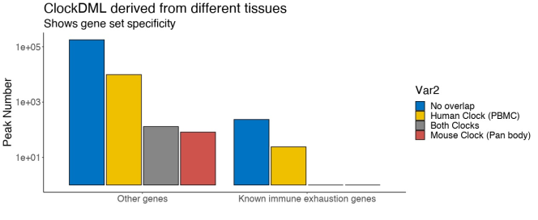
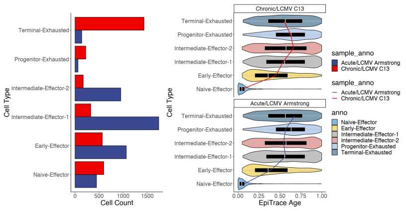
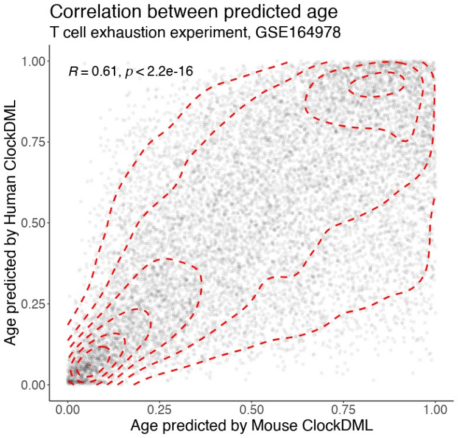
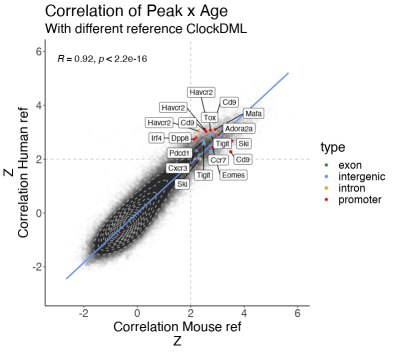

Mouse T cell aging in chronic viral infection
---------------------------------------------

In this tutorial, we would start to move from human to other species. Here we would show you how to perform a simple single cell age estimation with EpiTrace in a non-human mammalian species, using a scATAC dataset of mouse T cells :cite:p:`Pritykin2021`. In this experiment, mouse were either infected by LCMV clone 13 (LCMV C13) strain into chronic infection state, or LCMV Armstrong strain which could only result in an acute infection. We aim to directly observe mitosis age of T cells under these two different circumstances. 

One interesting part of the tutorial is, we would also test using different reference clock-like loci in the EpiTrace analysis. We would test whether change of reference clock-like loci would result in variations of age estimation and age-associated peak identification. To do this, we plan to use two drastically different reference clock-like loci set:

1. a set of mouse reference clock-like differential methylated loci, which is derived from pan-body mouse DNA methylation study :cite:p:`Zhou2022`. This reference set is an exact species-match to our applied scATAC dataset. However, being a pan-body ClockDML set, it is not matching the tissue of our target.  

2. the homologous mouse genomic region of human clock-like differential methylated loci provided by our package, which is derived from human donor PBMC DNA methylation study. This reference set could be a good tissue-match to our applied scATAC dataset. However, it is not derived from the same species. 

At the end of the tutorial, we will show that EpiTrace can accomodate both reference clock-like loci for estimating single cell age and revealing age-associated chromatin accessibility dynamics. 

Prior to work, you need to download the processed scATAC data from `the NCBI GEO website <https://www.ncbi.nlm.nih.gov/geo/query/acc.cgi?acc=GSE164978>`_. The mouse ClockDML set MM285/347 data ``mm285_design_clock347_gr.rds`` is provided by EpiTrace package in the ``data`` folder. To reproduce the full tutorial we assume that you have obtained the ``Hg19ToMm10`` chain file, which is available from UCSC. However if you cannot run the liftover we have provided a human-mapped-to-mouse reference clock-like loci data ``mouse_clock_lifted_human_to_mouse_mm10.rds`` with EpiTrace package, also in the ``data`` folder. For simplicity, we assume you have already collected all these prerequistic data into a ``GSE164978`` dir. 

Step 1. Initialize environment for EpiTrace
'''''''''''''''''''''''''''''''''''''''''''

Load environment as::

    library(dplyr)
    library(tidyr)
    library(readr)
    library(GenomicRanges)
    library(reshape2)
    library(openxlsx)
    library(ggplot2)
    library(Matrix)
    library(EpiTrace)
    library(Seurat)
    library(SeuratObject)
    library(ggtree)
    library(patchwork)
    library(ArchR)
    library(parallel)
    library(ChIPseeker)
    setwd('GSE164978') # set this to your working dir
    datadir = 'GSE164978'  # set this to your data dir

Step 2. Prepare the reference clock-like loci
'''''''''''''''''''''''''''''''''''''''''''''
If you have lift-over capability, you can do lift-over of human clocks into mouse genome as::

    # map human clock to mouse
    easyLift::easyLiftOver(plyranges::reduce_ranges(c(clock_gr_list[[1]],clock_gr_list[[2]])),map = '/gpfs/genomedb/chains/hg19ToMm10.over.chain') -> mouse_clock_by_human
    
Otherwise, just load them from the package::

    ## load the  “human-map-to-mouse clocks”
    mouse_clock_by_human <- readRDS('mouse_clock_lifted_human_to_mouse_mm10.rds')
    
The mouse clock are available for loading from package::

    ## load the  “mouse clocks”
    mouse_clock_by_MM285 <- readRDS('mouse_clock_mm285_design_clock347_mm10.rds')
    

Step 3. Prepare the mouse scATAC data
'''''''''''''''''''''''''''''''''''''
Mouse data are provided as MatrixMarket format so we use `Matrix::readMM` to process it::

    peaks_df <- read_tsv('GSE164978_scATAC_peaks.bed.gz',col_names = c('chr','start','end'))
    cells <- read_tsv('GSE164978_scATAC_barcodes.tsv.gz',col_names=c('cell'))
    mm <- Matrix::readMM(gzfile('GSE164978_scATAC_matrix.mtx.gz'))
    peaks_df$peaks <- paste0(peaks_df$chr,'-',peaks_df$start,'-',peaks_df$end)
    EpiTrace::Init_Peakset(peaks_df) -> init_gr
    EpiTrace::Init_Matrix(peakname = peaks_df$peaks,cellname = cells$cell,matrix = mm) -> init_mm

Step 4. EpiTrace analysis 
'''''''''''''''''''''''''''''''''''''
Mouse clock, applied to mouse scATAC::

    EpiTraceAge_Convergence(peakSet = init_gr,matrix=init_mm,ref_genome='mm10',clock_gr=mouse_clock_by_MM285,iterative_time = 5,min.cutoff = 0,non_standard_clock = T,qualnum = 10,ncore_lim = 48,mean_error_limit = 0.1) -> epitrace_obj_age_conv_estimated_by_mouse_clock
    
Human-origin clock, applied to mouse scATAC::

    EpiTraceAge_Convergence(peakSet = init_gr,matrix=init_mm,ref_genome='mm10',clock_gr=mouse_clock_by_human,iterative_time = 5,min.cutoff = 0,non_standard_clock = T,qualnum = 10,ncore_lim = 48,mean_error_limit = 0.1) -> epitrace_obj_age_conv_estimated_by_human_clock

Step 5. Compute genome-wide age-x-peak association
''''''''''''''''''''''''''''''''''''''''''''''''''
Mouse clock, applied to mouse scATAC. Note here we identified the T-cell population and additionally computed the sub-population age-x-peak association::

    epitrace_obj_age_conv_estimated_by_mouse_clock[['all']] <- Seurat::CreateAssayObject(counts = init_mm[,c(epitrace_obj_age_conv_estimated_by_mouse_clock$cell)],min.cells = 0,min.features = 0,check.matrix = F)
    DefaultAssay(epitrace_obj_age_conv_estimated_by_mouse_clock) <- 'all'
    epitrace_obj_age_conv_estimated_by_mouse_clock <- Signac::RunTFIDF(epitrace_obj_age_conv_estimated_by_mouse_clock)
    epitrace_obj_age_conv_estimated_by_mouse_clock <- Signac::FindTopFeatures(epitrace_obj_age_conv_estimated_by_mouse_clock, min.cutoff = 50)
    epitrace_obj_age_conv_estimated_by_mouse_clock <- Signac::RunSVD(epitrace_obj_age_conv_estimated_by_mouse_clock)
    epitrace_obj_age_conv_estimated_by_mouse_clock <- Seurat::RunUMAP(object = epitrace_obj_age_conv_estimated_by_mouse_clock, reduction = 'lsi', dims = 1:30)
    epitrace_obj_age_conv_estimated_by_mouse_clock <- FindNeighbors(object = epitrace_obj_age_conv_estimated_by_mouse_clock, reduction = 'lsi', dims = 1:30)
    epitrace_obj_age_conv_estimated_by_mouse_clock <- FindClusters(object = epitrace_obj_age_conv_estimated_by_mouse_clock,resolution=0.5)
    phylotree_res <- RunEpiTracePhylogeny(epitrace_obj_age_conv_estimated_by_mouse_clock,run_reduction=T)
    AssociationOfPeaksToAge(epitrace_obj_age_conv_estimated_by_mouse_clock,epitrace_age_name = "EpiTraceAge_iterative",parallel = T,peakSetName = 'all') -> asso_res_mouse_clock
    AssociationOfPeaksToAge(subset(epitrace_obj_age_conv_estimated_by_mouse_clock,seurat_clusters %in% c(4,0,1,5,3,7)),epitrace_age_name = "EpiTraceAge_iterative",parallel = T,peakSetName = 'all') -> asso_res_mouse_clock_lcmv
    
Human-origin clock, applied to mouse scATAC::

    epitrace_obj_age_conv_estimated_by_human_clock[['all']] <- Seurat::CreateAssayObject(counts = init_mm[,c(epitrace_obj_age_conv_estimated_by_human_clock$cell)],min.cells = 0,min.features = 0,check.matrix = F)
    DefaultAssay(epitrace_obj_age_conv_estimated_by_human_clock) <- 'all'
    epitrace_obj_age_conv_estimated_by_human_clock <- Signac::RunTFIDF(epitrace_obj_age_conv_estimated_by_human_clock)
    epitrace_obj_age_conv_estimated_by_human_clock <- Signac::FindTopFeatures(epitrace_obj_age_conv_estimated_by_human_clock, min.cutoff = 50)
    epitrace_obj_age_conv_estimated_by_human_clock <- Signac::RunSVD(epitrace_obj_age_conv_estimated_by_human_clock)
    epitrace_obj_age_conv_estimated_by_human_clock <- Seurat::RunUMAP(object = epitrace_obj_age_conv_estimated_by_human_clock, reduction = 'lsi', dims = 1:30)
    epitrace_obj_age_conv_estimated_by_human_clock <- FindNeighbors(object = epitrace_obj_age_conv_estimated_by_human_clock,reduction='lsi',dims=1:30)
    epitrace_obj_age_conv_estimated_by_human_clock <- FindClusters(object = epitrace_obj_age_conv_estimated_by_human_clock,resolution=0.5)
    phylotree_res <- RunEpiTracePhylogeny(epitrace_obj_age_conv_estimated_by_human_clock,run_reduction=T)
    AssociationOfPeaksToAge(epitrace_obj_age_conv_estimated_by_human_clock,epitrace_age_name = "EpiTraceAge_iterative",parallel = T,peakSetName = 'all') -> asso_res_human_clock
    AssociationOfPeaksToAge(subset(epitrace_obj_age_conv_estimated_by_human_clock,seurat_clusters %in% c(3,4,7,1,2,5)),epitrace_age_name = "EpiTraceAge_iterative",parallel = T,peakSetName = 'all') -> asso_res_human_clock_lcmv
    
    
Step 6. Annotate the peaks 
''''''''''''''''''''''''''
We annotate the peaks by whether they are overlapping with the human-derived or mouse-original clock-like loci::    

    asso_res_human_clock2 <- asso_res_human_clock
    colnames(asso_res_human_clock2)[1] <- 'peaks'
    left_join(asso_res_human_clock2,peaks_df) -> asso_res_human_clock2
    asso_res_human_clock2_gr <- makeGRangesFromDataFrame(asso_res_human_clock2)
    findOverlaps(asso_res_human_clock2_gr,peaks_anno_gr) -> overlap_res2
    findOverlaps(asso_res_human_clock2_gr,mouse_clock_by_human) -> overlap_res_human_clock
    findOverlaps(asso_res_human_clock2_gr,mouse_clock_by_MM285) -> overlap_res_mouse_clock
    asso_res_human_clock2$gene <- ''
    asso_res_human_clock2$type <- ''
    asso_res_human_clock2$Clock <- 'none'
    asso_res_human_clock2$gene[overlap_res2@from ] <- peaks_anno_gr$gene[overlap_res2@to]
    asso_res_human_clock2$type[overlap_res2@from ] <- peaks_anno_gr$type[overlap_res2@to]
    asso_res_human_clock2$Clock[overlap_res_human_clock@from %>% unique()] <- 'human'
    asso_res_human_clock2$Clock[overlap_res_mouse_clock@from %>% unique()] <- 'mouse'
    asso_res_human_clock2$Clock[overlap_res_human_clock@from[overlap_res_human_clock@from %in% overlap_res_mouse_clock@from]  %>% unique()]  <- 'both'
    asso_res_human_clock2$Clock[abs(asso_res_human_clock2$scaled_correlation_of_EpiTraceAge)>=3 & asso_res_human_clock2$Clock %in% 'none'] <- 'derived'

    saveRDS(asso_res_human_clock2,file='asso_res_human_clock2.rds')
    saveRDS(asso_res_mouse_clock,file='asso_res_mouse_clock.rds')
    
    asso_res_human_clock_lcmv2 <- asso_res_human_clock_lcmv
    colnames(asso_res_human_clock_lcmv2)[1] <- 'peaks'
    left_join(asso_res_human_clock_lcmv2,peaks_df) -> asso_res_human_clock_lcmv2
    asso_res_human_clock_lcmv2_gr <- makeGRangesFromDataFrame(asso_res_human_clock_lcmv2)
    findOverlaps(asso_res_human_clock_lcmv2_gr,peaks_anno_gr) -> overlap_res2
    findOverlaps(asso_res_human_clock_lcmv2_gr,mouse_clock_by_human) -> overlap_res_human_clock
    findOverlaps(asso_res_human_clock_lcmv2_gr,mouse_clock_by_MM285) -> overlap_res_mouse_clock
    asso_res_human_clock_lcmv2$gene <- ''
    asso_res_human_clock_lcmv2$type <- ''
    asso_res_human_clock_lcmv2$Clock <- 'none'
    asso_res_human_clock_lcmv2$gene[overlap_res2@from ] <- peaks_anno_gr$gene[overlap_res2@to]
    asso_res_human_clock_lcmv2$type[overlap_res2@from ] <- peaks_anno_gr$type[overlap_res2@to]
    asso_res_human_clock_lcmv2$Clock[overlap_res_human_clock@from %>% unique()] <- 'human'
    asso_res_human_clock_lcmv2$Clock[overlap_res_mouse_clock@from %>% unique()] <- 'mouse'
    asso_res_human_clock_lcmv2$Clock[overlap_res_human_clock@from[overlap_res_human_clock@from %in% overlap_res_mouse_clock@from]  %>% unique()]  <- 'both'
    asso_res_human_clock_lcmv2$Clock[abs(asso_res_human_clock2$scaled_correlation_of_EpiTraceAge)>=3 & asso_res_human_clock2$Clock %in% 'none'] <- 'derived'
    
    saveRDS(asso_res_human_clock_lcmv2,file='asso_res_human_clock2_lcmv.rds')
    saveRDS(asso_res_mouse_clock_lcmv,file='asso_res_mouse_clock_lcmv.rds')

Step 7. Check whether different reference clock-like loci sets have cell-type specificity. 
'''''''''''''''''''''''''''''''''''''''''''''''''''''''''''''''''''''''''''''''''''''''''''
We classify the origin of reference clock-like loci near known immune exhaustion gene::   

    asso_res_human_clock2 <- readRDS('asso_res_human_clock2_lcmv.rds')
    asso_res_mouse_clock <- readRDS('asso_res_mouse_clock_lcmv.rds')
    colnames(asso_res_mouse_clock)[1] <- 'peaks'
    asso_res_human_clock2$Clock_classified_by_ref <- asso_res_human_clock2$Clock
    asso_res_human_clock2$Clock_classified_by_ref <- gsub('derived','none',asso_res_human_clock2$Clock_classified_by_ref) %>% stringr::str_to_title() %>%  factor(levels=stringr::str_to_title(c('none','human','mouse','both')))
    asso_res_human_compare_to_mouse <- left_join(asso_res_human_clock2,asso_res_mouse_clock %>% dplyr::mutate(scaled_correlation_of_EpiTraceAge_mouse=scaled_correlation_of_EpiTraceAge,correlation_of_EpiTraceAge_mouse=correlation_of_EpiTraceAge) %>% dplyr::select(-correlation_of_EpiTraceAge,-scaled_correlation_of_EpiTraceAge))         asso_res_human_compare_to_mouse <- arrange(asso_res_human_compare_to_mouse,Clock_classified_by_ref)
    target_gene <- c('Pdcd1','Havcr2','Tox','Ccr7','Eomes','Cxcr3','Adora2a','Cd9','Tigit','Mafa','Ski','Dpp8','Irf4')
    
     table(asso_res_human_compare_to_mouse$gene%in%target_gene,asso_res_human_compare_to_mouse$Clock_classified_by_ref) -> tb1
      # tb1/rowSums(tb1)->tb1
      rownames(tb1) <- c('Other genes','Known immune exhaustion genes')
      colnames(tb1) <- c('No overlap','Human Clock (PBMC)','Both Clocks','Mouse Clock (Pan body)')
      pheatmap::pheatmap(tb1[,2:4],fontsize = 20,cellwidth = 22,cellheight = 22)
      melt(tb1) -> df3
      ggplot(df3,aes(x=Var1,y=value+1,fill=Var2)) + geom_col(position = position_dodge(0.9),width = 0.85,size=0.5,color='black') + scale_y_log10() + theme_classic() + theme(text=element_text(size=20)) + scale_fill_jco() + xlab('') + ylab('Peak Number') + ggtitle('ClockDML derived from different tissues','Shows gene set specificity')
      
The result is shown below:

   
Hence, the two reference clock-like loci sets are very different. Similar to its PBMC tissue-of-origin, the human-derived reference clock-like loci is more likely to locate near known T-cell-exhaustion genes. 

   
Step 8. Estimated single cell age correlated with T cell exhaustion and infection state. 
''''''''''''''''''''''''''''''''''''''''''''''''''''''''''''''''''''''''''''''''''''''''
We then plot the cell age (mouse reference derived) against cell type (annotated) and infection state::   

    meta1 <- as.data.frame(epitrace_obj_age_conv_estimated_by_human_clock@meta.data)
    meta2 <- as.data.frame(epitrace_obj_age_conv_estimated_by_mouse_clock@meta.data)
    
    meta1 %>% dplyr::group_by(seurat_clusters) %>% dplyr::summarise(meanAge=mean(EpiTraceAge_iterative)) %>% arrange(meanAge) -> df1
    meta1$seurat_clusters <- factor(meta1$seurat_clusters,levels=df1$seurat_clusters)
    
    meta1[meta1$seurat_clusters%in%c(3,4,7,1,2,5),] %>% dplyr::group_by(sample,seurat_clusters) %>% dplyr::summarise(meanAge=mean(EpiTraceAge_iterative),count=n()) %>% arrange(meanAge) -> df2
    meta2 <- meta1[meta1$seurat_clusters%in%c(3,4,7,1,2,5),] %>% droplevels
    meta2$seurat_clusters <- factor(meta2$seurat_clusters,levels=rev(levels(meta2$seurat_clusters)))
    anno_list <- c(
      '3'='Terminal-Exhausted',
      '7'='Progenitor-Exhausted',
      '4'='Intermediate-Effector-2',
      '1'='Intermediate-Effector-1',
      '2'='Early-Effector',
      '5'='Naive-Effector'
    )
    meta2$anno <- '' 
    for (x in names(anno_list)){
      meta2$anno[meta2$seurat_clusters %in% x] <- anno_list[x]
    }
    meta2$anno <- factor(meta2$anno,levels=rev(anno_list))
    meta2$sample_anno <- gsub('^1$','Acute/LCMV Armstrong',gsub('^2$','Chronic/LCMV C13',meta2$sample)) %>% factor(levels=c('Acute/LCMV Armstrong','Chronic/LCMV C13'))
    meta2 %>% dplyr::group_by(anno) %>% dplyr::summarise(meanAge=mean(EpiTraceAge_iterative),count=n()) %>% arrange(meanAge) -> df3
    meta2 %>% dplyr::group_by(anno,sample_anno) %>% dplyr::summarise(meanAge=mean(EpiTraceAge_iterative),count=n()) %>% arrange(meanAge) -> df4
    
    df4 <- df4 %>% dplyr::mutate(sample_anno_2 = factor(sample_anno,levels=c('Chronic/LCMV C13','Acute/LCMV Armstrong')))
    df4 %>% ggplot(aes(x=anno,y=count,fill=sample_anno)) + geom_col(position='dodge',size=0.5,color='black') + coord_flip() + scale_fill_aaas() + theme_classic() + theme(text=element_text(size=20),legend.position = 'right') + xlab('Cell Type') + ylab('Cell Count') -> p1
    
    df4 %>% ggplot(aes(x=anno,y=meanAge,color=sample_anno,group=sample_anno))  + geom_line() + geom_violin(data=meta2,aes(y=EpiTraceAge_iterative,group=anno,fill=anno),color='black',size=0.5,scale='width',alpha=0.5)  + geom_boxplot(data=meta2,aes(y=EpiTraceAge_iterative,group=anno),width=0.3,outlier.alpha = 0,fill='black',color='gray',size=0.5) + geom_line(size=0.8) + scale_color_aaas() + theme_classic() + coord_flip() + scale_fill_jco() + facet_wrap(~sample_anno_2,ncol=1) + theme(text=element_text(size=20),legend.position = 'right') + xlab('Cell Type') + ylab('EpiTrace Age') -> p2
    
    (p1|p2) + plot_layout(guides='collect')

The result is shown below:

   
These results show that despite without tissue specificity, the mouse reference clock-like loci derived single cell age is still closely associated with T cell exhaustion state and infection time.  

   
Step 9. Compare the single cell age estimated by two reference clock-like loci sets. 
''''''''''''''''''''''''''''''''''''''''''''''''''''''''''''''''''''''''''''''''''''
We then compare the single cell ages derived by two different reference genomic regions::   

    meta3 <- left_join(meta1,meta2 %>% dplyr::mutate(EpiTraceAge_iterative_mouse=EpiTraceAge_iterative)%>%dplyr::select(EpiTraceAge_iterative_mouse,cell))
    ggplot(meta3,aes(x=EpiTraceAge_iterative_mouse,y=EpiTraceAge_iterative)) + geom_point(alpha=0.05) + geom_density2d(color='red',size=1,linetype='dashed')  + ggpubr::stat_cor(color='black',size=6) + theme_classic() + theme(text=element_text(size=20)) + ggtitle('Correlation between predicted age','T cell exhaustion experiment, GSE164978') + xlab('Age predicted by Mouse ClockDML') + ylab('Age predicted by Human ClockDML')

The result shows that single cell ages estimated by two different reference clock-like loci sets are correlated:

   
Despite their difference in nature, both reference clock-like loci results in quite similar single cell age prediction. 

Step 10. Compare the age-x-peak correlation coefficients estimated by two reference clock-like loci sets. 
''''''''''''''''''''''''''''''''''''''''''''''''''''''''''''''''''''''''''''''''''''''''''''''''''''''''
Age-x-peak correlation coefficients are compared by::   

    target_gene <- c('Pdcd1','Havcr2','Tox','Ccr7','Eomes','Cxcr3','Adora2a','Cd9','Tigit','Mafa','Ski','Dpp8','Irf4')
    ggplot(asso_res_human_compare_to_mouse,aes(x=scaled_correlation_of_EpiTraceAge_mouse,y=scaled_correlation_of_EpiTraceAge)) + geom_point(alpha=0.01) + geom_density2d(linetype='dashed',color='gray')  +  geom_smooth(method='lm',color='cornflowerblue') + ggpubr::stat_cor(size=5) + geom_point(data=asso_res_human_compare_to_mouse[asso_res_human_compare_to_mouse$gene %in% target_gene & abs(asso_res_human_compare_to_mouse$scaled_correlation_of_EpiTraceAge)>2 & abs(asso_res_human_compare_to_mouse$scaled_correlation_of_EpiTraceAge_mouse)>2,],aes(fill=type),pch=21,size=2,color='gray') + ggrepel::geom_label_repel(data=asso_res_human_compare_to_mouse[asso_res_human_compare_to_mouse$gene %in% target_gene &  abs(asso_res_human_compare_to_mouse$scaled_correlation_of_EpiTraceAge)>2 & abs(asso_res_human_compare_to_mouse$scaled_correlation_of_EpiTraceAge_mouse)>2,],aes(label=gene),force = 4,max.overlaps = Inf) + theme_classic() + theme(text=element_text(size=20)) + xlab('Correlation Mouse ref\nZ') + ylab('Z\nCorrelation Human ref') + xlim(c(-3,6)) + ylim(c(-3,6)) + ggtitle('Correlation of Peak x Age','With different reference ClockDML') + geom_hline(linetype='dashed',yintercept = c(2),color='gray') + geom_vline(linetype='dashed',xintercept = c(2),color='gray') + scale_fill_manual(values = c('forestgreen','cornflowerblue','orange','red'))

The result is shown below:

   
Despite the two reference clock-like loci has difference in nature, age-x-peak correlation coefficient derived from the two experiments are highly similar. 
   
